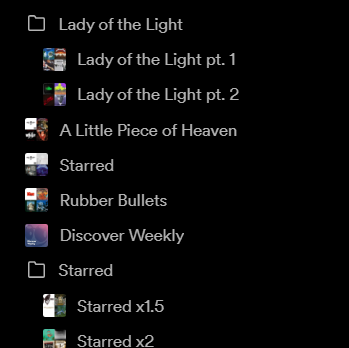

# Spicetify-playlist-artwork

Adds playlist artwork and folder icons to the playlists panel for quicker indentification of playlists.



It caches playlist artwork urls in an indexed database after initial fetch for faster access. There is a menu option in the spicetify menu to refresh the cache to force refetch:


as well as a right click context menu item for refreshing individual playlists' artwork:


# Installation

- Copy `./dist/playlist-artwork.js` to `~/.spicetify/plugins`
- run:

```
spicetify config extensions playlist-artwork.js
spicetify apply
```

or install through [spicetify marketplace](https://github.com/CharlieS1103/spicetify-marketplace)

# Made with spicetify Creator

Spicetify Creator is a tool to compile modern Typescript/Javascript code to Spicetify extensions and custom apps.

## Features

- Typescript and React syntax
- Import node packages
- CSS/SCSS with PostCSS support
- Extremely fast compile time with esbuild.
- Plugins

## Docs

Check out [Spicetify's docs](https://spicetify.app/docs/development/spicetify-creator/the-basics)!

## Available scripts

- `build`: Compiles the extension to spicetify
- `build-local`: Compiles the extension to ./dist folder
- `watch`: Compiles the extension to spicetify and watches for changes
- `watch-local`: Compiles the extension to ./dist folder and watches for changes
